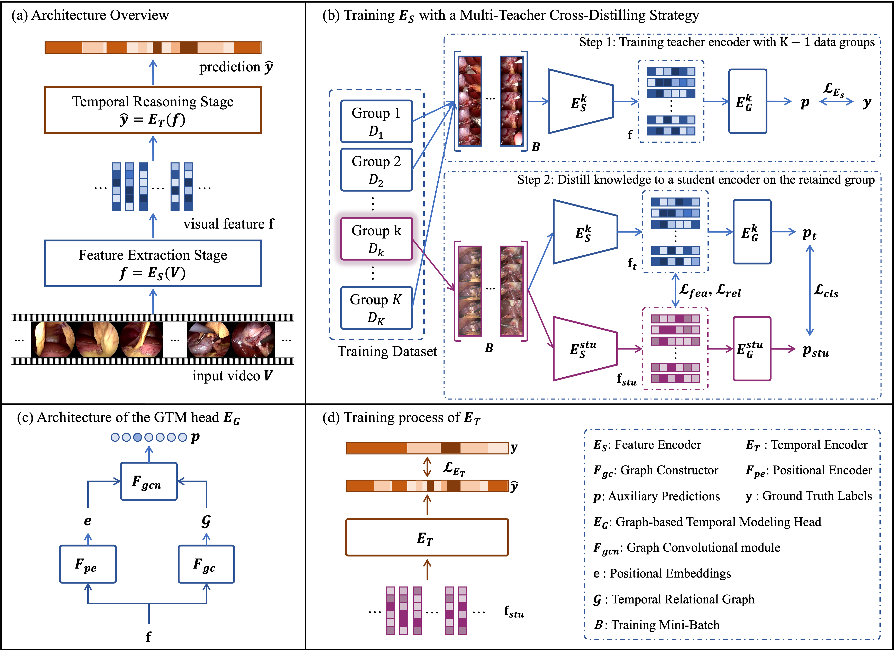

# MGTR-Net

Code for the paper "**Multi-Teacher Graph Temporal Relational Network for Online Surgical Workflow Recognition**"




## Evaluate the MGTR-Net

- **stage 1: Feature Extraction**

1. [Download](https://drive.google.com/drive/folders/1Rg8B1soyGkr0-24zI0o6BowZIbNvBcTj?usp=share_link) the pre-trained checkpoint file of the feature encoder and put it to `MGTR-Net/ckpts/cholec80/student_encoder.pth`
2. Run the following code to extract the visual features: 

```bash
python feature_extraction.py
```

or you can [download](https://drive.google.com/drive/folders/1TzmSUc2W_BBP5qB1NcP1Defc4C2XbfPl?usp=share_link) our pre-extracted features and put them to `MGTR-Net/features/cholec80/`


- **stage 2: Temporal Reasoning**

1. [Download](https://drive.google.com/drive/folders/1Rg8B1soyGkr0-24zI0o6BowZIbNvBcTj?usp=share_link) the pre-trained checkpoint file of the temporal encoder and put it to `MGTR-Net/ckpts/cholec80/temporal_encoder.pth`
2. Run the following code to generate predictions of the surgical workflow:

```
python eval.py
```

You will get the following results:

```
{'acc': 92.97337300624586, 'recall': 85.68485972864084, 'precision': 87.43070462776161, 'jaccard': 78.1865950509938}
```


- **Evaluate the MGTR-Net with a 10 second relaxed boundary**

To evaluate the with 10 second relaxed boundaries, move to `MGTR-Net/evaluations/matlab-eval/cholec80/`, then run the following code to calculate the evaluation metrics:

```
matlab Main.m
```

You will get the following results:

```
================================================
                    Phase|  Jacc|  Prec|   Rec|
================================================
              Preparation| 89.12| 97.73| 91.33|
---------------------------------------------
  CalotTriangleDissection| 97.78| 98.99| 98.87|
---------------------------------------------
          ClippingCutting| 81.05| 98.20| 83.12|
---------------------------------------------
    GallbladderDissection| 89.47| 91.30| 98.58|
---------------------------------------------
     GallbladderPackaging| 79.33| 87.06| 91.35|
---------------------------------------------
      CleaningCoagulation| 63.20| 85.53| 69.06|
---------------------------------------------
    GallbladderRetraction| 78.47| 88.04| 91.57|
---------------------------------------------
================================================
Mean jaccard: 82.63 +- 11.00
Mean accuracy: 94.06 +-  4.65
Mean precision: 92.41 +-  5.79
Mean recall: 89.13 +- 10.32
```


## Train the MGTR-Net

The training code will be released as soon as this manuscript is accepted to publish.

